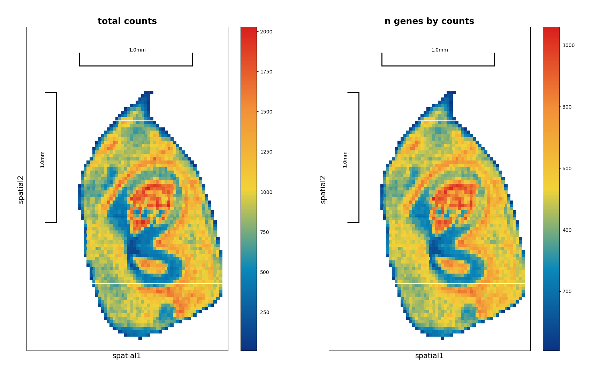
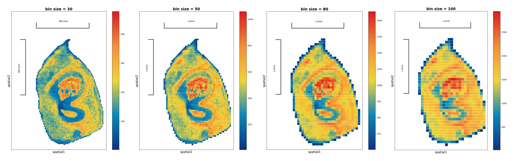

# Preprocess

## 1. Data aquisition
We categorize the preprocessing of plant ST data into four parts: data acquisition, defining spatial units, constructing a spatial matrix with coordinates, and quality control. 

Here we use the data from the paper ["Spatiotemporal transcriptomic landscape of rice embryonic cells during seed germination"](https://doi.org/10.1016/j.devcel.2024.05.016), it is a `rice seed embryo` spatial transcriptomics dataset from `stereo-seq`.
- The data has been aligned, quantified and barcode mapped through the [SAW workflow](https://github.com/STOmics/SAW)
- The data input here is GEM file, which is the output of the SAW workflow.
- The dataset is available at Spatial Transcript Omics DataBase, STOmics DB [STT0000049](https://db.cngb.org/stomics/project/STT0000049/spatialGeneExpression)
- The pipiline [stereppy](https://stereopy.readthedocs.io/en/latest/index.html) is used to process the data. It accepts the GEM/GEF file (from Sterep-seq) and H5ad (output from scanpy) as input.


```python
import sys
import os
import warnings
import stereo as st
warnings.filterwarnings('ignore')
```


<style>.bk-root, .bk-root .bk:before, .bk-root .bk:after {
  font-family: var(--jp-ui-font-size1);
  font-size: var(--jp-ui-font-size1);
  color: var(--jp-ui-font-color1);
}
</style>


```python
data_path = '/home/yaoj/Review_plant_Spatial_multiomics_data_analysis/data/A5_1_bin1.gem.gz'
# read GEM file information
st.io.read_gem(data_path)
```

## 2. Define spatial units

### 2.1 Bin segmentation
Bin segmentation is simpler and more widely adopted, where the key step involves determining the appropriate bin size. The average cell size within the tissue is estimated using image information, and tools like `ImageJ`, and `CaseViewer` are often employed. The bin size can then be optimized based on clustering results, ensuring the clusters correspond to distinct cell types and are biologically interpretable 

We estimate the average cell size in this rice seed embryo dataset is 25 μm².
- Cell side length = X * ST_resolution
- X is the bin size, in Bin 50, stereo-seq resolution is 0.5 um, the cell side length is 50 * 0.5 = 25 um


```python
# define the bin size= 50
data = st.io.read_gem(file_path=data_path, bin_size=50)
data
```
    StereoExpData object with n_cells X n_genes = 2566 X 25320
    bin_type: bins
    bin_size: 50
    offset_x = 10025
    offset_y = 8025
    cells: ['cell_name']
    genes: ['gene_name']
    cells_matrix = ['spatial']
    Layers with keys: 
    result: []

```python
#data.tl.cal_qc()
data.plt.spatial_scatter()
```

    [2025-01-18 03:31:51][Stereo][433552][MainThread][140065997267328][st_pipeline][41][INFO]: start to run cal_qc...
    [2025-01-18 03:31:52][Stereo][433552][MainThread][140065997267328][st_pipeline][44][INFO]: cal_qc end, consume time 0.1649s.

    BokehModel(combine_events=True, render_bundle={'docs_json': {'eee6ab55-1588-4559-888b-5eee0a19dc22': {'defs': …

    

    

Test bin size = 30,50,80,100, and compare the results


```python
import panel as pn
def compare_multiple_bins(file_path, bin_sizes=[30, 50, 80, 100]):
    plots = []  # 存储所有图形对象
    for bin_size in bin_sizes:
        # 读取数据
        data = st.io.read_gem(file_path=file_path, bin_size=bin_size)
        data.tl.cal_qc()
        
        # plot spatial scatter
        plot = data.plt.spatial_scatter(
            cells_key=['n_genes_by_counts'],
            width=2,
            height=2,
            title=[f'bin size = {bin_size}']
        )
        plots.append(plot)
    
    # use panel's Row layout to display all plots side by side
    return pn.Row(*plots)

# use the function
pn.extension()  # initialize panel
combined_plot = compare_multiple_bins(data_path)
combined_plot
```



### 2.2 Cell segmentation
**Cell segmentation** offers a more granular approach, especially in tissues where cell size exhibit considerable variability. Recent advancements in segmentation tools allow for more precise delineation of individual cells, typically using cell wall staining images and manually annotated training models. Popular tools include `Cellpose2/3`, `StarDist`. Comprehensive ST frameworks, such as `STCellBin`, support segmentation based on models trained with Arabidopsis seed cell segmentation ground truth.

- Here we use `Cellpose2` to segment the cells.
- The model we trained according to the cell wall staining images of rice seed embryo is available at [https://github.com/YAOJ-bioin/REGSTA-script](https://github.com/YAOJ-bioin/REGSTA-script)


```powershell
##cell segmentation
#cellpose installation
#download environment.yml from https://github.com/MouseLand/cellpose
#cmd
conda env create -f environment.yml
conda activate cellpose
pip install cellpose


#prediction:
python -m cellpose  --exclude_on_edges  --dir .\data4test\img --diameter 0  --save_outlines  --save_txt  --in_folders --verbose --flow_threshold 5 --pretrained_model .\model\cellpose_residual_on_style_on_concatenation_off_CP_1_2022_11_26_02_48_20.469512

#--dir  (only slice images saving path)
#--save_txt   ("outlices.txt" whice serves as cell segmentation result in next step ,will be saved in a folder which is named "txt_outlines")
#--pretrained_model  (path of auto-segmentation model)
```


## 3. Construct a spatial matrix with coordinates


## 4. Quality control and data optimization
### 4.1 Quality control
### 4.2 data imputation
### 4.3 batch correction

