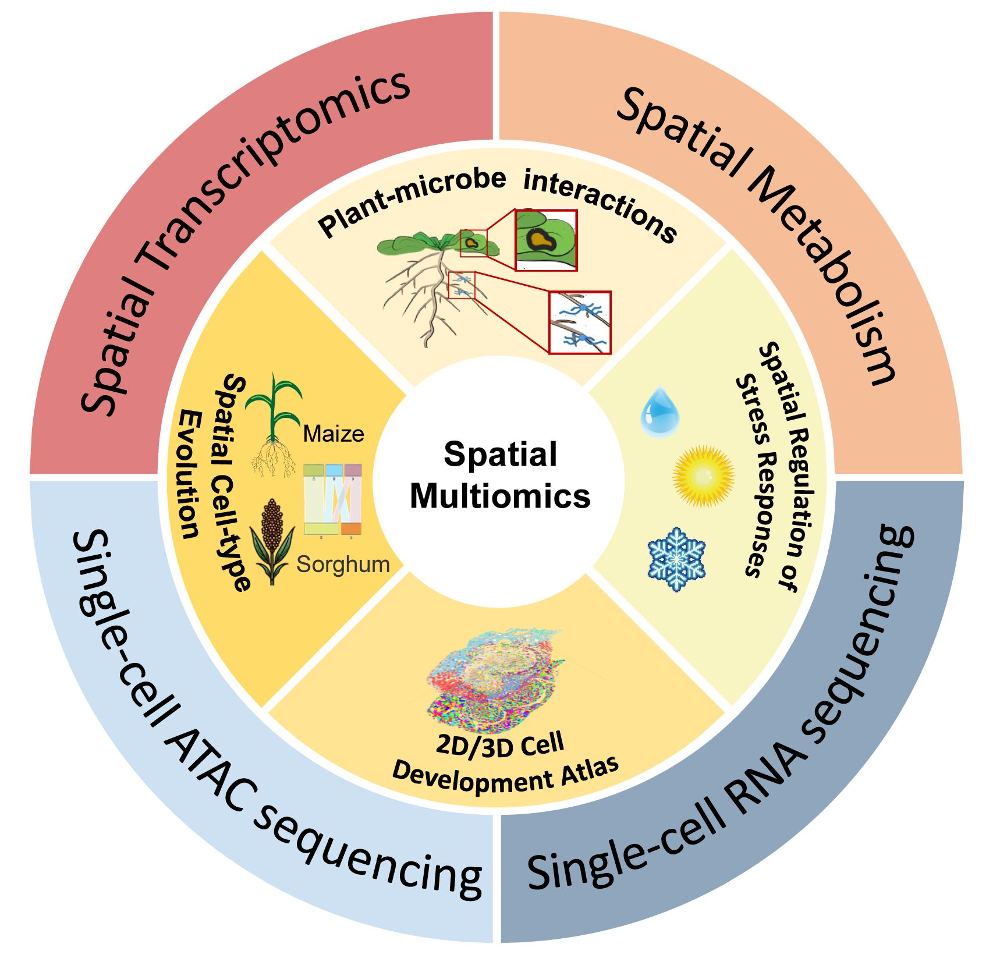

# Welcome to spatial multiomics data analysis in plants!

⭐ This is practical guide for spatial multiomics data analysis in plants.

Recent advancements in plant spatial omics, including spatial transcriptomics and metabolomics, offer detailed cellular information by integrating spatial positional data. When combined with single-cell technologies such as sc/snRNA-seq and scATAC-seq, these methods significantly enhance the study of complex biological processes like plant cell development, plant-microbe interactions, stress responses, and the evolution of cell types across species. However, plant cells possess unique traits, such as specialized cell walls and considerable size variability, requiring the adaptation of human-based data analysis strategies for plant research. This review outlines the current research landscape and provides a comprehensive overview of strategies for acquiring plant spatial multi-omics data, as well as the preprocessing workflows and analysis techniques used in the field. Additionally, we present a spatial multi-omics dataset on the mature seed in plants and provide a detailed tutorial to demonstrate the practical application of these advanced tools and methods in research settings. This work aims to provide valuable resources and guidance to practitioners and researchers in the field of plant spatial multi-omics.

For more details about the this guide, please check out our publication.

## Contact¶
Jie Yao (andy-yaoj@zju.edu.cn)

## Publication
Jie Yao, Alexander P. Marand,  Longjiang Fan, "Advances in plant spatial multiomics data analysis". 2025.
